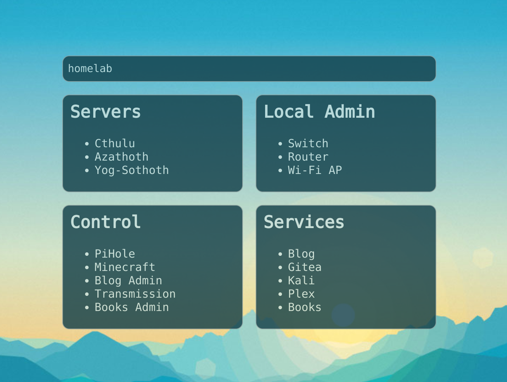

# startpage

just the startpage i use locally on my laptop with darkhttpd. there's a few cool features:

## mini pages

pages of links to useful locations, or anything else really. 
reads in a directory of the pages from `./content`.
page loads if the page name is typed, checked on each keypress.

## shortcuts

shortcuts again executed when a keyword is typed

